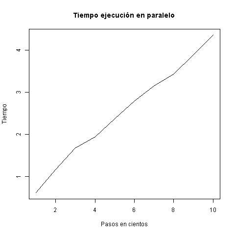

% Ventajas del uso de paralelismo en la simulación de retornos al origen en movimiento Browniano
% José Alberto Benavides Vázquez
% 10 de agosto de 2017

# Introducción

El movimiento Browniano es un movimiento que se realiza en una dirección elegida al azar durante un determinado número de repeticiones[^eda897fc]. En esta simulación se utilizó el software y lenguaje R con la librería parallel.

# Hipótesis
El paralelismo disminuye tiempos de ejecución en tareas que se pueden realizar simultáneamente.

# Simulación y Resultados
Esta simulación realiza 1000 pasos en caminatas de una de 8 dimensiones, moviéndose en una dimensión al azar una unidad positiva o negativa, elegida de manera aleatoria con una probabilidad del 0.5 cada una. Este experimento se repite 1000 veces por caminata.

Durante la caminata, se controla en cada paso que la distancia Manhattan entre la posición actual y el origen sean iguales o menores que la cantidad de pasos restantes, de manera que no se tengan que recorrer todos los pasos en los casos en que los pasos restantes ya no sean suficientes para regresar al origen.

Además, en cada experimento se controla la media de retornos al origen por dimensión, de manera que cuando tras un experimento su media de retorno al origen es menor a 0.5, se abortan los experimentos con más dimensiones, pues las probabilidades de regreso se vuelven despreciables.

Una vez concluida la simulación de retornos al origen en un movimiento Browniano como el que se ha descrito arriba, se obtuvo la siguiente gráfica:

En esta imagen se puede observar que mientras en una dimensión hay una mediana de 20 retornos al origen, mientras este valor se reduce drásticamente a 2 en dos dimensiones y se tienen valores muy cercanos a 0.5 en 3 y 4 dimensiones.

Una vez que se obtienen estos resultados, se procede a analizar el tiempo requerido para realizar cada serie de experimentos por la última caminata (en este caso la de 4 dimensiones) mediante el uso de la función parSapply, incluida en la librería parallel, lo que quiere decir que estos experimentos se realizaron de manera paralela utilizando 3 núcleos de los 4 procesadores lógicos que posee el procesador Intel(R) Core(TM) i7-3520M CPU @ 2.90GHz, 2901 Mhz, en donde se corrió este experimento. Los tiempos de ejecución son como siguen:

Estos resultados demuestran que el incremento en pasos guarda una relación lineal respecto al tiempo que toma en realizarse el experimento. Ahora bien, estos mismos experimentos realizados de manera no paralela toman los siguientes tiempos:

La duración de cada experimento, si se realiza de manera no paralela requiere aproximadamente el doble de tiempo que el transcurrido de manera paralela con las mismas condiciones.

# Conclusión
1. El uso de paralelismo reduce drásticamente los tiempos de ejecución de código susceptible de ser corrido en paralelo.
2. El incremento de pasos en el movimiento Browniano incrementa de manera lineal los tiempos de ejecución de la simulación.
3. Los retornos al origen se vuelven prácticamente imposibles al superar las 3 dimensiones en una caminata Browniana.

[^eda897fc]: http://elisa.dyndns-web.com/teaching/comp/par/p1.html
