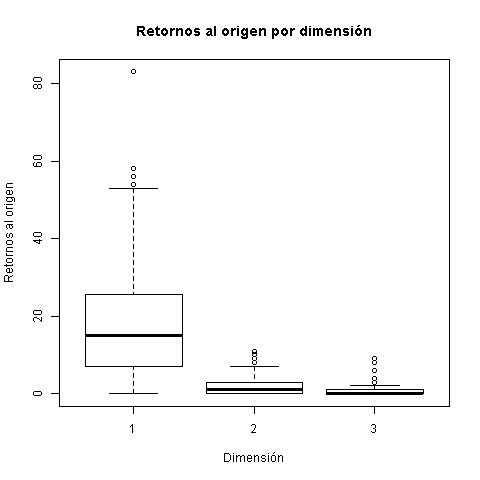
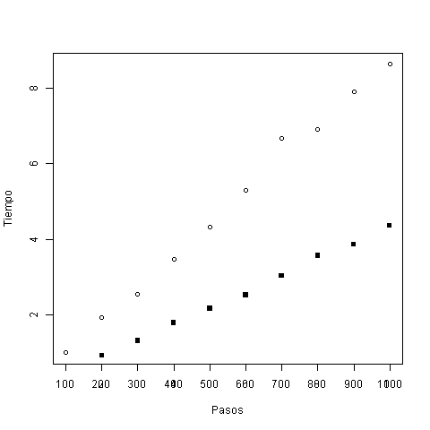

% Ventajas del uso de paralelismo en la simulación de retornos al origen en movimiento Browniano
% José Alberto Benavides Vázquez
% 10 de agosto de 2017

# Introducción

El movimiento Browniano es un movimiento que se realiza en una dirección elegida al azar durante un determinado número de repeticiones[^eda897fc]. En esta simulación se utilizó el software y lenguaje R con la librería parallel.

# Hipótesis
El paralelismo disminuye tiempos de ejecución en tareas que se pueden realizar simultáneamente.

# Simulación y Resultados
Esta simulación realiza $1000$ pasos en caminatas de $1$ a $8$ dimensiones, moviéndose cada paso en una dimensión al azar, una unidad positiva o negativa, elegida de manera aleatoria con una probabilidad de $0.5$ cada una. Este experimento se repite $1000$ veces por caminata.

Durante la caminata, se controla en cada paso que la distancia Manhattan entre la posición actual y el origen sean iguales o menores que la cantidad de pasos restantes, de manera que no se tengan que recorrer todos los pasos en los casos en que los pasos restantes ya no sean suficientes para regresar al origen.

Además, en cada experimento se controla la media de retornos al origen por dimensión, de manera que cuando tras un experimento su media de retorno al origen es menor a $0.5$, se abortan los experimentos con más dimensiones, pues las probabilidades de regreso se vuelven despreciables.

Una vez concluida la simulación de retornos al origen en un movimiento Browniano como el que se ha descrito arriba, se obtuvo la siguiente gráfica:



En esta imagen se puede observar que mientras en $1$ dimensión hay una mediana de $24.161$ retornos al origen, mientras este valor se reduce significativamente a $2.111$ en $2$ dimensiones y $0.512$ en $3$. La media para $4$ dimensiones fue de $0.267$.

Una vez que se obtienen estos resultados, se procede a analizar el tiempo requerido para realizar cada serie de experimentos por la última caminata (en este caso, la de $4$ dimensiones) mediante el uso de la función `parSapply`, incluida en la librería `parallel`. Estos experimentos se realizaron de manera paralela utilizando $3$ de los $4$ procesadores lógicos que posee el procesador Intel(R) Core(TM) i7-3520M CPU @ 2.90GHz, 2901 Mhz, en donde se corrió este experimento. Además, se corrió la misma cantidad de experimentos de manera no paralela a través de la función `sapply`. Para cada caso, en caminatas de 100 hasta los $1000$ pasos, en recorridos de $100$ en $100$ pasos. Los tiempos de ejecución se calcularon mediante la instrucción `system.time` y se tomó como parámetro de medición del tiempo la tercer columna de sus retultados, es decir, el tiempo transcurrido (`elapsed time`). Dichas mediciones se grafican como sigue:



Estos resultados demuestran que el incremento en pasos guarda una relación lineal respecto al tiempo que toma en realizarse el experimento. Ahora bien, estos mismos experimentos realizados de manera no paralela requieren aproximadamente el doble de tiempo que el transcurrido de manera paralela con las mismas condiciones.

# Conclusión
1. El uso de paralelismo reduce drásticamente los tiempos de ejecución de código susceptible de ser corrido en paralelo.
2. El incremento de pasos en el movimiento Browniano incrementa de manera lineal los tiempos de ejecución de la simulación.
3. Los retornos al origen se vuelven prácticamente imposibles al superar las 3 dimensiones en una caminata Browniana.

[^eda897fc]: http://elisa.dyndns-web.com/teaching/comp/par/p1.html

# Código

```r
library(parallel)

dimensions <- 8
repetitions <- 1000
steps <- 1000

timesReturnedData <- data.frame()
elapsedParallelData <- data.frame()
elapsedData <- data.frame()

experiment <- function(r){
  position <- rep(0, dimension)
  origin <- rep(0, dimension)
  timesReturned <- 0
  for(step in 1:steps){
    d <- sample(1:dimension, 1)
    if(runif(1) > 0.5){
      position[d] <- position[d] + 1
    } else{
      position[d] <- position[d] - 1
    }

    if(all(position == origin)){
      timesReturned <- timesReturned + 1
    }

    distanceToOrigin <- sum(abs(position - origin))
    stepsLeft <- steps - step

    if(distanceToOrigin > stepsLeft){
      break
    }
  }
  return(timesReturned)
}

cluster <- makeCluster(detectCores() - 1)
clusterExport(cluster, "steps")
maxDimension <- NULL
for (dimension in 1:dimensions) {
  clusterExport(cluster, "dimension")
  result <- parSapply(cluster, 1:repetitions, experiment)
  timesReturnedData <- rbind(timesReturnedData, result)

  if(mean(result) < 0.5){
    maxDimension <- dimension
    alert <- paste("INFO: En ", dimension, "dimensiones, la media de regresos al origen (", mean(result), ") es inferior a 0.5, por lo que se descarta el regreso en m\u00E1s dimensiones.")
    print(alert)
    break
  } else{
    alert <- paste("INFO: Media de dimensi\u{F3}n ", dimension, ": ", mean(result), ".")
    print(alert)
  }
}
stopCluster(cluster)

png("TimesReturned_Dimension.png")
boxplot(data.matrix(timesReturnedData), use.cols=FALSE,
xlab="Dimensi\u{F3}n", ylab="Retornos al origen")
graphics.off()
print("INFO: Imagen de Retornos al origen generada.")

cluster <- makeCluster(detectCores() - 1)
dimension <- maxDimension
clusterExport(cluster, "dimension")
parallelExperimentTime <- NULL
experimentTime <- NULL
totalSteps <- steps
for (steps in seq(100, totalSteps, 100)) {
  experimentTime <- system.time(sapply(1:repetitions, experiment))[3]
  elapsedData <- rbind(elapsedData, experimentTime)

  clusterExport(cluster, "steps")
  parallelExperimentTime <- system.time(
    parSapply(cluster, 1:repetitions, experiment))[3]
  elapsedParallelData <- rbind(elapsedParallelData, parallelExperimentTime)
}
stopCluster(cluster)

png("ElapsedTime_Experiment.png")
plot(data.matrix(elapsedData), xlab="Pasos", ylab="Tiempo")
points(data.matrix(elapsedParallelData), pch=15)
axis(1, at=seq(100, totalSteps, 100), labels=seq(100, totalSteps, 100))
graphics.off()
print("INFO: Imagen de Tiempo ejecuci\u{F3}n generada.")
```
