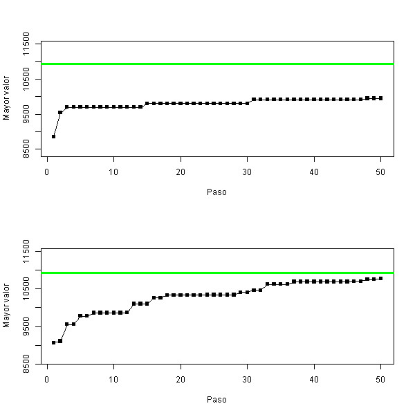

# Objetivos
1. Paralelizar el algoritmo genético de la práctica número diez del curso **R paralelo: simulación y análisis de datos** publicada por Schaeffer [-@schaeffer] y estudiar los efectos en su tiempo de ejecución.
2. Cambiar la selección de padres para reproducción a que use seleccion de ruleta: cada solución se selecciona como padre con una probabilidad que es directamente proporcional a su valor de función objetivo (conviene aprovechar el parámetro prob en sample).

# Simulación y resultados
El equipo usado en esta simulación contaba con sistema operativo Windows 10 Home Single Language, procesador Intel(R) Core(TM) i7-7500U CPU @ $2.70$GHz, $2904$MHz de dos núcleos principales y cuatro lógicos. El lenguaje de programación utilizado fue R.

A lo largo del código, se paralelizaron los ciclos que iteraban entre número de individuos y número de reproducciones, correspondientes a las funciones `poblacion.inicial`, `mutacion`, `reproduccion`, `objetivo` y `factible`, de las cuales, sólo la primera no pertenece propiamente al algoritmo genético. Las variables iniciales son $200$ individuos (`init`) con $50$ cromosomas (`n`) cada uno, una probabilidad de mutación de $0.05$ (`pm`) y $50$ reproducciones (`rep`) entre individuos por cada generación de un total de $50$ generaciones (`tmax`). Las funciones se paralelizaron con dos núcleos físicos por `parSapply` de la librería `parallel`, como sigue:

```r
poblacion.inicial <- function(n, tam) {
  pobl <- matrix(rep(FALSE, tam * n), nrow = tam, ncol = n)
  if(parallel){
    a <- parSapply(cluster, 1:tam, function(i){
      round(runif(n))
    })
    pobl <- t(a)
  } else{
    for (i in 1:tam) {
      pobl[i,] <- round(runif(n))
    }
  }
  return(as.data.frame(pobl))
}
[...]

clusterExport(cluster, "pm")
clusterExport(cluster, "mutacion")
clusterExport(cluster, "n")
clusterExport(cluster, "p")
a <- parSapply(cluster, 1:tam, function(i){
  if (runif(1) < pm) {
    mutacion(p[i,], n)
  }
})
a <- Filter(Negate(is.null), a)
a <- data.frame(matrix(unlist(a), nrow=50, byrow=T))
a <- t(a)
p <- rbind(p, a)
[...]

clusterExport(cluster, "p")
clusterExport(cluster, "tam")
clusterExport(cluster, "reproduccion")
a <- parSapply(cluster, 1:rep, function(i){
  padres <- sample(1:tam, 2, replace=FALSE)
  hijos <- reproduccion(p[padres[1],], p[padres[2],], n)
  hijo1 <- hijos[1:n] # primer hijo
  hijo2 <- hijos[(n+1):(2*n)] # segundo hijo
  return(rbind(hijo1, hijo2))
})
a <- data.frame(matrix(unlist(a), nrow=50, byrow=T))
a <- t(a)
p <- rbind(p, a)
rownames(p) <- 1:nrow(p)
[...]

clusterExport(cluster, "p")
clusterExport(cluster, "obj")
clusterExport(cluster, "fact")
clusterExport(cluster, "objetivo")
clusterExport(cluster, "valores")
clusterExport(cluster, "factible")
clusterExport(cluster, "pesos")
clusterExport(cluster, "capacidad")
a <- parSapply(cluster, 1:tam, function(i){
  obj <- c(obj, objetivo(unlist(p[i,]), valores))
  fact <- c(fact, factible(unlist(p[i,]), pesos, capacidad))
  return(cbind(fact, obj))
})
a <- t(a)
colnames(a) <- c("fact", "obj")
p <- cbind(p, a)
```

Una muestra de los valores generados por el algoritmo se muestran en la figura \ref{p10} (p. \pageref{p10}) donde, aunque se aproximan, no logran dar con el valor óptimo en las generaciones definidas.


El estudio del tiempo que toma correr este algoritmo con y sin paralelización se realizaron diez repeticiones para cada prueba, cuyos diagramas de caja y bigotes pueden consultarse en la figura \ref{times} (p. \pageref{times}) y comprobar que el tiempo de ejecución del algoritmo en paralelo es menor que el requerido por el mismo código sin paralelizar el experimento.


Se realizó una regresión lineal para obtener la relación entre el tiempo paralelo y secuencial mediante la función de R `lm(tiempo ~ tipo, data = times)` y así conocer la relación que existe entre ambos. El tipo de corrida $p = [1, 2]$ y el tiempo de ejecución $t$ están relacionados mediante la ecuación $t = -6.86p + 16.30$, de donde se tiene, por la pendiente $m = -6.86$, que al paralelizar se disminuye $6.86$ veces el tiempo de ejecución, datos que pueden visualizarse en la figura \ref{rl} (p. \pageref{rl}).


Se llamará *selección natural* a la manera en que los padres han sido elegidos hasta ahora y *selección artificial* a la regida por la selección de ruleta definida en el objetivo 2. Para comprobar si una selección artificial de los padres mejora los valores estimados por el algoritmo, se agregó el parámetro `prob` a la función `sample`, de la siguiente manera:

```r
for (i in 1:tam) {
  pObj <- c(pObj, objetivo(unlist(p[i,]), valores) / optimo)
}
[...]

padres <- sample(1:tam, 2, replace=FALSE, prob = pObj)
```

Los resultados arrojados, para ambas gráficas, se pueden observar en la figura \ref{challenge1} (p. \pageref{challenge1}) la cual evidencia que este tipo de selección mejora el algoritmo.



La relación entre ambas también se calculó, para este par de conjuntos de datos, mediante una regresión lineal en donde se halló, dadas la presencia o ausencia del algoritmo genético $a$ y los valores obtenidos $v$, que la ecuación $v = 429.12a + 9306.88$ las relaciona. Esto se muestra en la figura \ref{rlch1} (p. \pageref{rlch1}), de donde se puede concluir que hay una mejora entre la selección natural y artificial de los padres de la siguiente generación.


# Referencias
