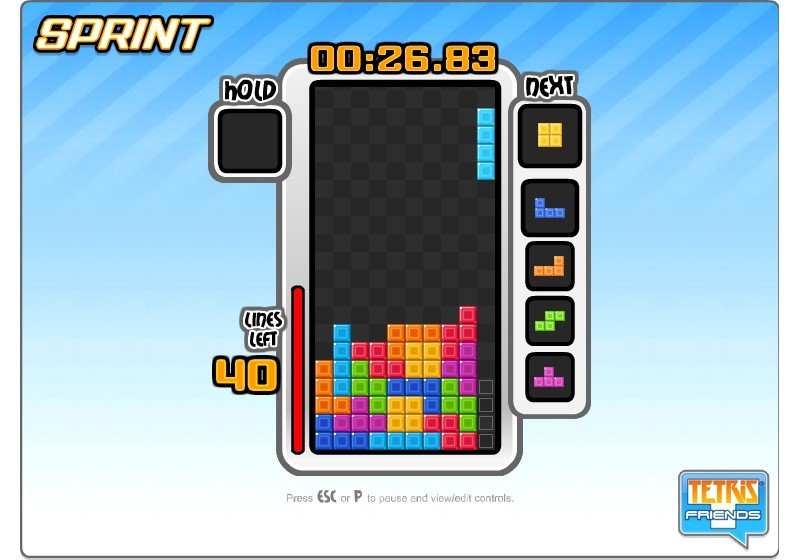
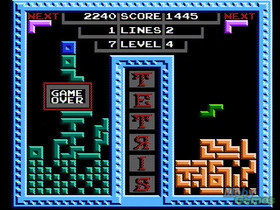
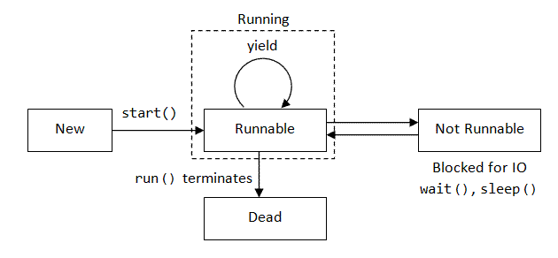

% Teoría de colas
% Alberto Benavides
% 24 de agosto de 2017

# Hipótesis

La cantidad de núcleos usados en una simulación paralela en R y el orden con que se pasan las operaciones a dichos núcleos modifican los tiempos de ejecución de las tareas completas.

# Objetivos
1. Examinar las diferencias en los tiempos de ejecución de un mismo experimento con diferentes ordenamientos en distintos núcleos en paralelo.
2. Argumentar las posibles causas a las diferencias en los tiempos de ejecuciones y razonar cómo y por qué afecta el número de núcleos disponibles a la diferencia.
3. Aplicar pruebas estadísticas para determinar si las diferencias observadas entre los tres ordenamientos son significativas.

# Simulación y resultados

En una computadora con sistema operativo Windows 10 Home Single Language y el procesador Intel(R) Core(TM) i7-7500U CPU @ 2.70GHz, 2904 Mhz de dos procesadores principales y cuatro procesadores lógicos, se ha partido del siguiente código[^d9638f1c]:

[^d9638f1c]: http://elisa.dyndns-web.com/teaching/comp/par/p3.html

```r
prime <- function(n) {
  if (n == 1 || n == 2) {
    return(TRUE)
  }
  if (n %% 2 == 0) {
    return(FALSE)
  }
  for (i in seq(3, max(3, ceiling(sqrt(n))), 2)) {
    if ((n %% i) == 0) {
      return(FALSE)
    }
  }
  return(TRUE)
}
```

Este código revisa si un número es primo. El rango de números primos a revisar elegido fue de $1000$ a $3000$ y para comparar los diferentes tiempos que se tomó en realizar dichos cálculos, se ordenó ese rango de manera creciente, decreciente y aleatoria y cada secuencia fue almacenada en un vector que fue posteriormente ejecutado por la función `foreach` incluida en la librería `doParallel`[^ad1e3fcf] de R un total de diez veces.

[^ad1e3fcf]: https://cran.r-project.org/web/packages/doParallel/doParallel.pdf

Los promedios de los tiempos que tomaron las iteraciones se muestran en la Figura \ref{MeanTime_Cluster} (p. \pageref{MeanTime_Cluster}). Cada terna de valores mostrados utiliza de uno a cuatro núcleos, respectivamente, para correr los ciclos. Y se puede afirmar a partir de estos resultados que al utilizar 3 núcleos se obtiene un mejor desempeño, mientras que sistemáticamente la secuencia aleatoria de los números a pasar por la función `prime` es también la más óptima en términos de tiempo de ejecución.


Estas diferencias en los tiempos de ejecución entre los diferentes ordenamientos se pueden explicar debido a que los núcleos, aunque trabajen simultáneamente, sólo pueden ejecutar un proceso a la vez y pasar a otro hasta que terminen con el actual. Los procesos que recibe un núcleo se meten a una lista de espera análoga a una cola del tipo FIFO[^1ecd1725], pero se trata de una cola con un tamaño limitado en sus espacios. Se puede utilizar, de manera ilustrativa, una comparación con el clásico juego del Tetris[^718b0c52].

[^1ecd1725]: https://es.wikipedia.org/wiki/First_in,_first_out

[^718b0c52]: https://tetris.com/



[^7deecbb5]: https://tetris.com/article/81/tetris-friends-sprint-tips-and-tricks

Supongamos que cada columna del tablero mostrado en la Figura \ref{Tetris}[^7deecbb5] (p. \pageref{Tetris}) representa un núcleo y que cada grupo de colores por columna representa un proceso y su longitud, de manera que la pieza en l de la esquina superior derecha es un proceso que ocupa cuatro unidades en un núcleo. Así, la primer columna (de izquierda a derecha) necesita terminar un proceso azul de dos unidades de tamaño, para pasar a un proceso naranja de tres unidades.

Los tiempos de procesamiento se extienden con ordenamientos decrecientes y crecientes respecto a los aleatorios, porque en los primeros dos hay un punto en que los procesos más grandes impiden adjuntar nuevos procesos al no dejar espacio necesario para el siguiente proceso a ser atendido, como sucede en la Figura \ref{TetrisGameOver}[^69b5a69f] (p. \pageref{TetrisGameOver}) en que la pieza azul de la parte superior ya no tiene espacio para ser puesto en la cola porque otros procesos ocupan su lugar.



[^69b5a69f]: https://www.techbang.com/posts/21784-russia-blocks-goodbye

Es precisamente el hecho de que haya más núcleos disponibles la causa de que se disminuyan los tiempos de procesamiento. En el caso de tener un núcleo, sólo podría ejecutarse una instrucción a la vez y el resto que no puedan entrar en el tamaño de la cola, se quedarían a la espera de ser asignadas nuevamente a la misma en cuanto se desocupen sus lugares. Encima, esta espera se prolonga por el ciclo de vida de los hilos y procesos mostrado en la Figura \ref{Threads}[^47a9bf6d] (p. \pageref{Threads}).



[^47a9bf6d]: http://www.jtech.ua.es/dadm/2011-2012/restringido/android-av/sesion01-apuntes.html

Sin embargo, cuando se tienen más núcleos y se utilizan de manera paralela, estos procesos que no tienen cabida en uno de los núcleos, pueden asignarse a otro y así acortar los tiempos de procesamiento.

Estas especulaciones se pueden corroborar corriendo una prueba de Kruskal-Wallis agrupando los tiempos de ejecución por núcleos. Se ha elegido esta prueba debido a que los tiempos de ejecución obtenidos no tienen una distribución normal, lo que se evidencia en la Figura \ref{Density} (p. \pageref{Density}).


Al agrupar los tiempos por número de núcleos utilizados y correr la prueba estadística, se arroja un resultado de $p = 8.421e-16$, menor que $\alpha = 0.05$ . De esto se puede concluir que las diferencias en las medias de los tiempos por la cantidad de núcleos utilizados tiene una diferencia estadística sifnificativa[^084c634f].

[^084c634f]: http://support.minitab.com/en-us/minitab-express/1/help-and-how-to/modeling-statistics/anova/how-to/kruskal-wallis-test/interpret-the-results/key-results/

# Conclusión

1. Un orden aleatorio en tamaños de ciclos de procesamiento permite un mejor acomodo de los procesos en los núcleos disponibles, lo que optimiza su resolución.
2. Existe una reducción en tiempos de procesamiento significativa cuando se utilizan tres núcleos en comparación con uno, dos y cuatro.
