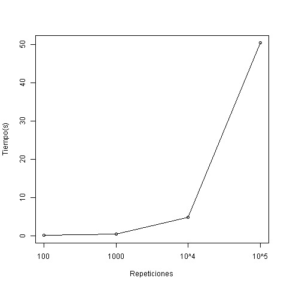
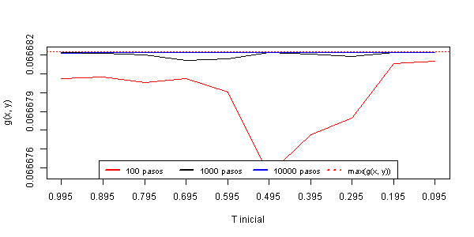

% Búsqueda local
% Alberto Benavides
% 25 de septiembre de 2017


# Objetivos
1. Maximizar la función bidimensional

$$g(x, y) = \frac{(x + 0.5)^4 - 30\times* x^2 - 20 \times x + (y + 0.5)^4 - 30 * y^2 - 20 \times y}{100}.$$

2. El primer reto es agregar una visualización de cómo procede una réplica de la búsqueda encima de una gráfica de proyección plana.
3. Cambiar la regla del movimiento de un punto al siguiente a la de recocido simulado.

# Simulación y resultados
La presente práctica se realizó en una computadora portátil con sistema operativo Windows 10 Home Single Language, procesador Intel(R) Core(TM) i7-7500U CPU @ $2.70$ GHz, $2904$ MHz de dos núcleos principales y cuatro lógicos.

Para maximizar $g(x, y)$ se desarrolló una función en que se genera un buscador en una coordenada al azar en un rango horizontal y vertical entre $-4$ y $4$, se calculan sus vecinos inferior izquierdo, superior izquierdo, superior derecho e inferior derecho a partir de un paso elegido en un rango de $[0, 0.2]$. El espacio donde se graficará la función se considerará un toroide, así que si un buscador sale del rango especificado, aparecerá por el lado contrario del eje por el que haya salido. Posteriormente se evaluará cada vecino en $g(x, y)$ y si es mayor que la evaluación del valor actual, se actualizará dicho valor para elegir de entre todos los vecinos, el más alto. Cada buscador se desplaza un total de $100$, $1000$, $10000$ y $100000$ pasos, simulándose cien buscadores por cantidad de pasos. Este experimento se ejecutó en la función `parSapply` de la librería `parallel` del lenguaje R y su código se muestra a continuación:

```r
low <- -4
high <- 4
step <- 0.2
experiment <- function(t) {
  curr <- c(
    runif(1, low, high), runif(1, low, high)
  )
  for (i in 1:maxTime) {
    delta <- runif(1, 0, step)
    left <- curr[1] - delta
    right <- curr[1] + delta
    bottom <- curr[2] - delta
    top <- curr[2] + delta
    if (left < low){
      left <- left + high
    }
    if (right > high){
      right <- right + low
    }
    if (bottom < low){
      bottom <- bottom + high
    }
    if (top > high){
      top <- top + low
    }
    if (g(left, bottom) > g(curr[1], curr[2])) {
      curr <- c(left, bottom)
    }
    if (g(left, top) > g(curr[1], curr[2])) {
      curr <- c(left, top)
    }
    if (g(right, top) > g(curr[1], curr[2])) {
      curr <- c(right, top)
    }
    if (g(right, bottom) > g(curr[1], curr[2])) {
      curr <- c(right, bottom)
    }
  }
  return(curr)
}
```

Una vez obtenidas las cien coordenadas de mayores resultados para cada iteración, se calculó el máximo de esos valores por iteración de pasos evidenciando que a mayor cantidad de pasos, la aproximación al resultado esperado es más cercana. En el rango establecido, el máximo local de $g(x, y)$ es $0.0666822$, valor obtenido de WolframAlpha[^945026fb]. Se puede cotejar este resultado con los obtenidos en el experimento descrito, mostrados en el cuadro \ref{ExperimentSummary} (p. \pageref{ExperimentSummary}) y graficados en la figura \ref{e1Test} (p. \pageref{e1Test}), y comprobar que a partir de los mil pasos se alcanzar valores muy cercanos al calculado.

[^945026fb]: http://www.wolframalpha.com/

\begin{table}[]
\centering
\caption{Valores $g(x, y)$ por pasos}
\label{ExperimentSummary}
\begin{tabular}{rc}
\hline
\multicolumn{1}{l}{\textbf{Pasos}} & máx$(g(x, y))$  \\ \hline
$100$                              & $0.06668212180$ \\
$1000$                             & $0.06668215618$ \\
$10000$                            & $0.06668215623$ \\
$100000$                           & $0.06668215624$ \\ \hline
\end{tabular}
\end{table}


Los tiempos de ejecución del experimento por cantidad de pasos se muestran en la figura \ref{ExperimentTimes} (p. \pageref{ExperimentTimes}). Puesto que a partir de mil pasos se obtuvieron resultados satisfactorios en este experimento y el tiempo que toma en correrse su simulación es pequeño, se eligió para estudiar el objetivo 3 esta misma cantidad de pasos.



Una visualización del recorrido de ocho buscadores puede revisarse como ejemplo en la siguiente dirección: https://goo.gl/9MCJVn. Esta animación representa varios buscadores que en un máximo de cien pasos buscan el valor máximo de $g(x, y)$ para un rango de $x$ e $y$ de $[-4, 4]$ con el algoritmo dado. Por lo general, un buscador tarda $40$ pasos en encontrar una máxima $g(x, y)$.

Para el objetivo 3, la regla de movimiento se modificó de la manera descrita en el reto 2 de la **Práctica 7: búsqueda local**[^38080c50], con la salvedad de que la probabilidad de aceptar a un vecino $x'$ toma $\delta$ en lugar de $-\delta$ para así poder obtener los máximos en lugar de los mínimos locales en $g(x, y)$. Además, se optó por actualizar $T$ sólo cuando se aceptara un vecino peor respecto a la búsqueda del mayor valor de $g(x, y)$. Los valores para $T$ dados fueron una secuencia de $0.995$ a $0.95$ en pasos de $-0.1$, esto es de más permisivo a menos permisivo. El siguiente código muestra la metodología descrita trasladada al lenguaje R:

[^38080c50]: http://elisa.dyndns-web.com/teaching/comp/par/p7.html

```r
t <- seq(0.995, 0, -0.1)
challenge2 <- function(r) {
  originalT <- t
  curr <- c(
    runif(1, low, high), runif(1, low, high)
  )
  for (i in 1:maxTime) {
    other <- c(
      curr[1] + runif(1, -step, step),
      curr[2] + runif(1, -step, step)
    )
    if (other[1] < low){
      other[1] <- other[1] + high
    }
    if (other[1] > high){
      other[1] <- other[1] + low
    }
    if (other[2] < low){
      other[2] <- other[2] + high
    }
    if (other[2] > high){
      other[2] <- other[2] + low
    }
    delta <- g(other[1], other[2]) - g(curr[1], curr[2])
    if (delta > 0){
      curr <- other
    } else if(delta < 0){
      if(runif(1) < exp(delta / t)){
        curr <- other
        t <- t * t
      }
    }
  }
  return(c(curr, g(curr[1], curr[2]), originalT))
}
```

Los resultados obtenidos en mil pasos por cada uno de los cien buscadores para cada valor de $T$ se plasmaron en la figura \ref{e2Max} (p. \pageref{e2Max}) donde, nuevamente, conforme aumenta la cantidad de pasos también la estimación es más cercana a la calculada, mostrada por una línea roja punteada. Además, valores poco permisivos mejoran la aproximación al resultado esperado. La media del tiempo que toma en correr este recocido para los valores definidos de $T$ en mil pasos es de $0.475$ segundos.



# Conclusiones
1. Una búsqueda local corrida en paralelo requiere tiempos menores para obtener aproximados significativos respecto a los esperados a partir de cálculos más precisos, pero igualmente más costosos en recursos informáticos y tiempo de ejecución.
2. Incrementar los pasos de los buscadores asegura lograr un valor más cercano al esperado, pero requiere más tiempo.
3. Es preferible utilizar un recocido simulado para realizar búsquedas locales, puesto que los resultados obtenidos son cercanos a los esperados con tiempos de corridos menores para la misma cantidad de pasos. Se recomienda, por los resultados observados, utilizar valores de $T$ menores a $0.2$ y mil pasos.

# Bibliografía
* WolframAlpha, http://www.wolframalpha.com/, revisado en 25 de septiembre de 2017.
* Elisa Schaeffer, *Práctica 7: búsqueda local*, http://elisa.dyndns-web.com/teaching/comp/par/p7.html, revisado en 25 de septiembre de 2017.
